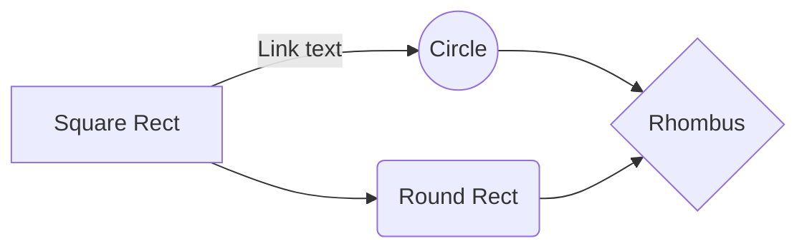

# Case study: How a bike sharing make a fast success being possible?
Hello! My name is Caio, i'm a beginner Data Analyst and this case study was made to show my data analysis hard and soft skills and it was based on the [Google data analytics certificate](https://www.coursera.org/learn/google-data-analytics-capstone) case study, so i applied all the knowledge i acquired in the whole course.

## Tools used
- MySql
- SQL-server on CommandLine
- Tableau

## Fictional scenario
In 2016, the fictitious company called Cyclistic has launched a succeed offer about bike sharing. Since then, the program increased to a 5,800 bicycles fleet with geografic traffic and almost 700 stations at Chicago. 

Until now, the marketing strategy was based on general awareness and wide customers range. What helped this idea get succeed was the flexibility in reference of price plans: `single trip pass`, `daily pass` and `annual plans`. Clients that purchase both single trip pass and daily pass are called **casual passengers** and clients that purchase annual plan are **cyclistic members**.

The financial analysts concluded that the cyclistic members are much more profitable than casual passengers. Despite the price flexibility helps the company to attract more clients, Lily Moreno (Marketing director) believes that maximizing the annual members number is the key to future company growth. 

Lily established a goal: create marketing strategies in order to convert casual passengers to annual members. But to do this, the marketing analyst team has four main business tasks
- Create marketing strategies to convert casual passengers to annual members
- Find the difference between annual members and casual passengers
- Why does casual passengers would like to get an annual plan
- How digital media would affect the marketing strategies

## Index
* Phase 1: [Ask](https://github.com/caiobarretobr/cyclistic_case_study?tab=readme-ov-file#ask)

* Phase 2: [Prepare](https://github.com/caiobarretobr/cyclistic_case_study?tab=readme-ov-file#phase-2-prepare)

    - 2.1 - [Create a database](https://github.com/caiobarretobr/cyclistic_case_study?tab=readme-ov-file#21---create-a-database)
    - 2.2 - [Test one table importing](https://github.com/caiobarretobr/cyclistic_case_study?tab=readme-ov-file#22---test-one-table-importing)
    - 2.3 - [Create 12 tables](https://github.com/caiobarretobr/cyclistic_case_study?tab=readme-ov-file#23---create-12-tables)
    - 2.4 - [Import 12 excel sheets to respective tables](https://github.com/caiobarretobr/cyclistic_case_study?tab=readme-ov-file#24---import-12-excel-sheets-to-respective-tables)
    - 2.5 - [Merge 12 tables into one table](https://github.com/caiobarretobr/cyclistic_case_study?tab=readme-ov-file#25---merge-12-tables-into-one-table)

* Phase 3: [Process](https://github.com/caiobarretobr/cyclistic_case_study?tab=readme-ov-file#phase-3-process)

    - 3.1 - [Data exploring](https://github.com/caiobarretobr/cyclistic_case_study?tab=readme-ov-file#31---data-exploring)
    - 3.2 - [Data cleaning](https://github.com/caiobarretobr/cyclistic_case_study?tab=readme-ov-file#32---data-cleaning)

* Phase 4: [Analyse](https://github.com/caiobarretobr/cyclistic_case_study?tab=readme-ov-file#phase-4-analyse)

* Phase 5: [Share](https://github.com/caiobarretobr/cyclistic_case_study?tab=readme-ov-file#phase-5-share)

* Phase 6: [Act](https://github.com/caiobarretobr/cyclistic_case_study?tab=readme-ov-file#phase-6-act)

### Phase 1: Ask 
There are three questions that will guide the marketing program future:
- How annual members and casual cyclist uses Cyclistic bicycles differently?
- Why does casual passengers would want to get Cyclistic annual plan?
- How does the Cyclistic can use digital media to influence casual passengers to become members?

### Phase 2: Prepare
_**Where's the Data Source?**_

The goal is to explore 1 year of the Cyclistic bike riding dataset, in which the data source is stored in a [AWS S3 Bucket](https://divvy-tripdata.s3.amazonaws.com/index.html), provided by Motivate International Inc, under [This](https://divvybikes.com/data-license-agreement) License. At this moment, the AWS source has datasets about 2020 to 2024, but the year used in this case study is 2021.

_**How's the data organized?**_
> SQL query [here](SQL/data_organizing.sql).

The tables are stored in `.csv` files, and it wil be imported to a MySQL database using MySQL-server command line. Each `.csv` will be represented by one table. After that, all tables will combined into only one table, the main Dataset. With this dataset, representing the 2021 cyclistic data, the `Process` step can be continued.

### Phase 3: Process - Exploring, cleaning and manipulation

### Data exploring
> SQL query [here](SQL/data_exploring.sql).

For familiarizing myself with the data, there are some characteristics about the data:

1. The dataset has rows
2. There is three types of bicycles: electric, classic and docked bikes
3. Number of trips in each bike:

4. Trips during longer than a day: 1,041 rows
5. Trips during shorter than a minute: 59,369 rows
6. Number of trips from both casual customers and annual members:

7. Also, there is more than 1 million rows with empty values in the columns `start_station_name`, `start_station_id`, `end_station_name`, `end_station_id`:

### Data cleaning
> SQL query [here](SQL/data_cleaning.sql).

After data exploring, i created a new table with the cleaned data based on the already existing table, in which all the tasks involved was:
* Adding a column with the duration of each trips in minutes
* Adding a new column with each trip's day of week (Monday = 1, Tueday = 2, Wednesday = 3, etc)
* Adding a new column containing each trip's month
* Deleting trips during longer than a day and less than a minute
* The new table has 4,527,643 rows, totalizing 1,067,420 rows deleted:

                                             
### Phase 4: Analyse - Analysing, Insights, Trends
> SQL query [here](SQL/data_analysis.sql)         

Depois de preparar os dados, onde foi feito a organização de dados, e depois da fase processar, onde foi feito uma exploração e limpeza dos dados, até agora, o conjunto de dados está organizado dessa forma:

### Phase 5: Share - Data Visualizations 
---
### Phase 6: Act: Final conclusions
